Let me fix the Mermaid syntax errors. Here are the corrected diagrams:

---

## 1. Overall Project Architecture

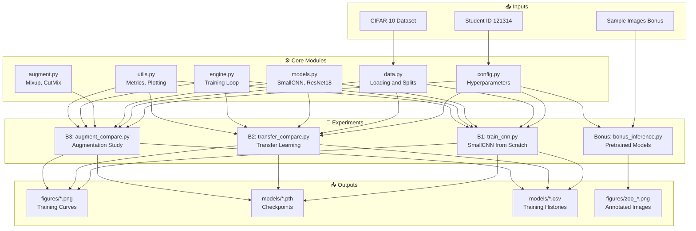

---

## 2. Data Pipeline Flow

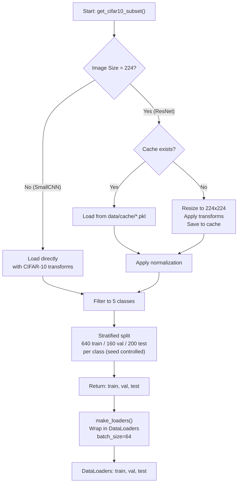

---

## 3. B1: SmallCNN Training

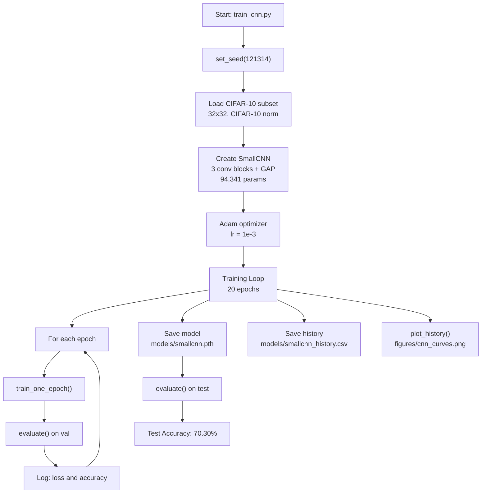

---

## 4. B2: Transfer Learning Comparison

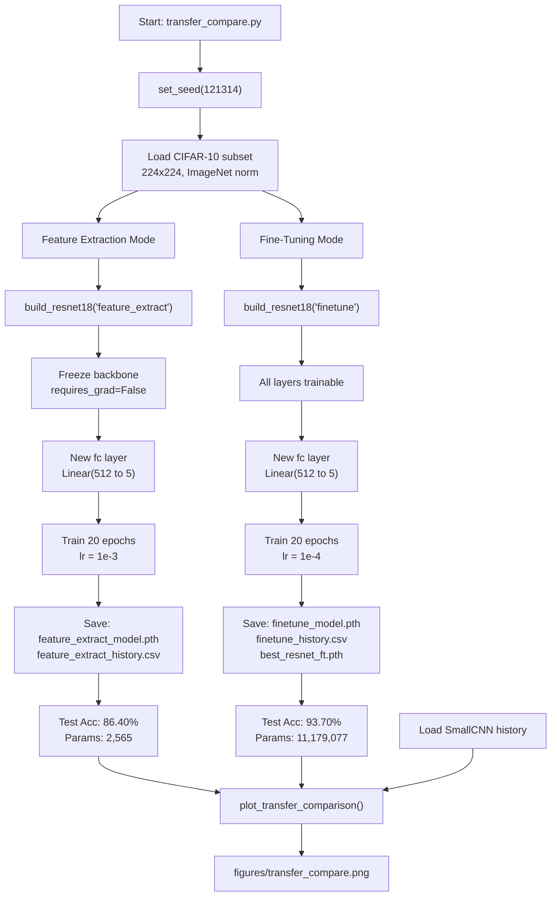

---

## 5. B3: Augmentation Study

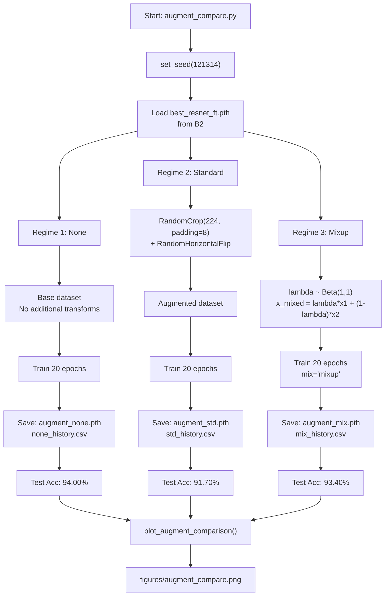

---

## 6. Bonus: Pretrained Model Inference

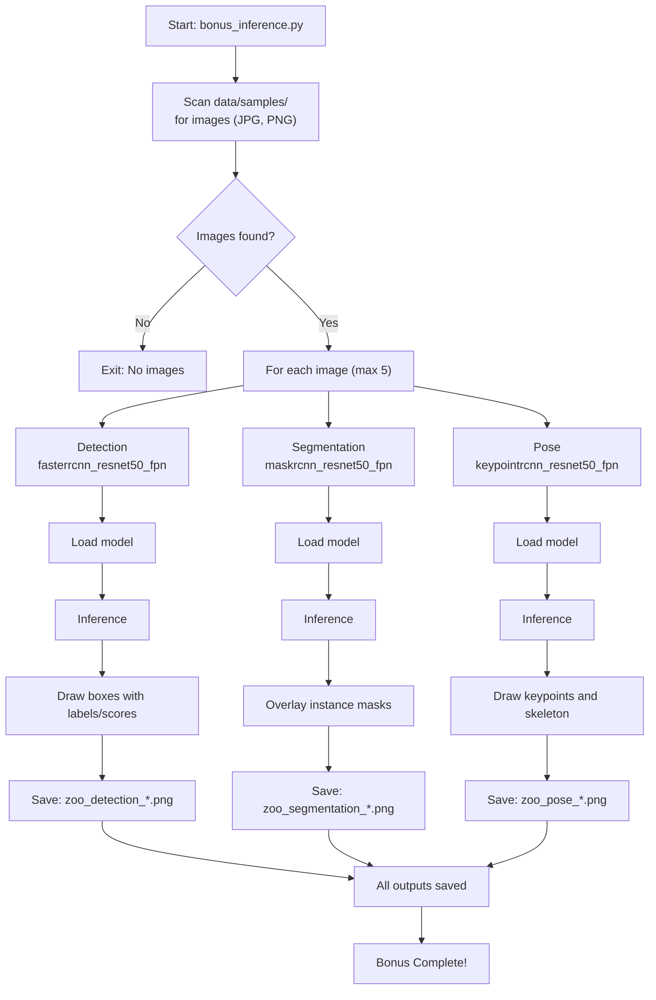

---

## 7. run_all.py Orchestration

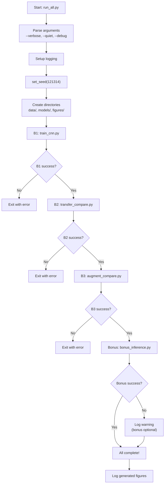

---

## 8. Smart Fallback Logic

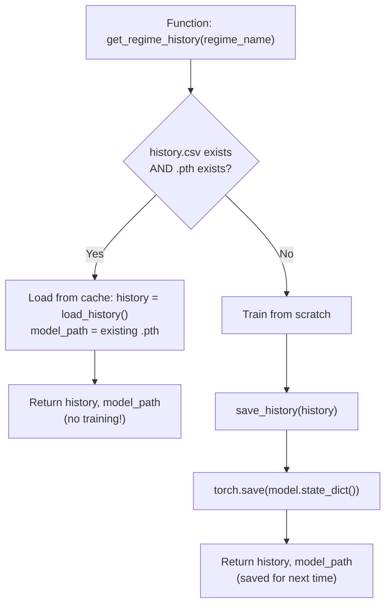

---

## 9. Complete Data Flow

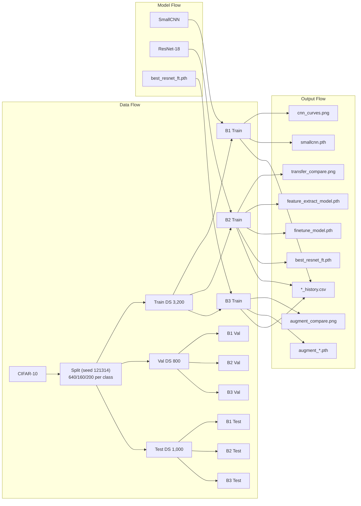

---

## 10. Test Workflow

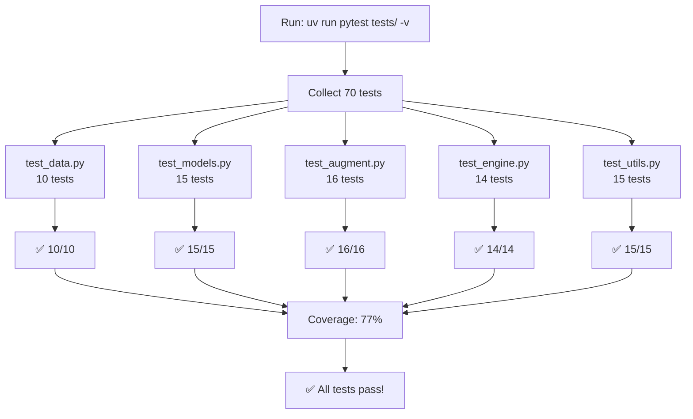

---

## 11. File Dependencies

```mermaid
flowchart TD
    subgraph CORE["Core Modules"]
        CONFIG["config.py"]
        DATA["data.py"]
        MODELS["models.py"]
        AUG["augment.py"]
        ENGINE["engine.py"]
        UTILS["utils.py"]
    end

    subgraph EXPS["Experiments"]
        B1["train_cnn.py"]
        B2["transfer_compare.py"]
        B3["augment_compare.py"]
        BONUS["bonus_inference.py"]
    end

    subgraph TESTS["Tests"]
        TDATA["test_data.py"]
        TMODELS["test_models.py"]
        TAUG["test_augment.py"]
        TENG["test_engine.py"]
        TUTILS["test_utils.py"]
    end

    B1 --> MODELS
    B1 --> ENGINE
    B1 --> UTILS
    B1 --> CONFIG

    B2 --> MODELS
    B2 --> ENGINE
    B2 --> UTILS
    B2 --> CONFIG
    B2 --> B1_HIST["(loads SmallCNN history)"]

    B3 --> MODELS
    B3 --> ENGINE
    B3 --> UTILS
    B3 --> CONFIG
    B3 --> B2_MODEL["(loads best_resnet_ft.pth)"]

    BONUS --> CONFIG

    TDATA --> DATA
    TDATA --> CONFIG

    TMODELS --> MODELS
    TMODELS --> CONFIG

    TAUG --> AUG

    TENG --> ENGINE
    TENG --> MODELS
    TENG --> CONFIG

    TUTILS --> UTILS
```

---

## 12. Training Loop Sequence

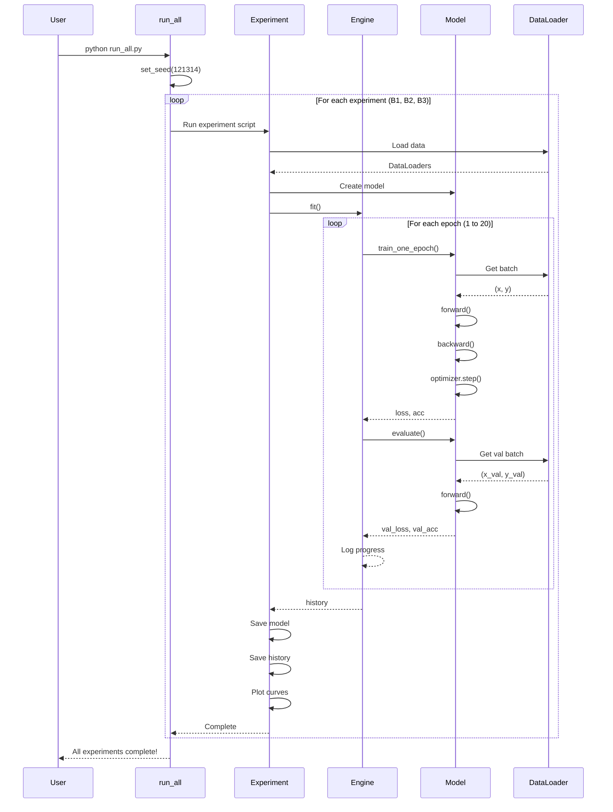

---

## Summary Table

| Phase | Component | Input | Output | Time |
|-------|-----------|-------|--------|------|
| **Data** | `data.py` | CIFAR-10 | 3,200/800/1,000 split | ~2-3 min |
| **B1** | `train_cnn.py` | Data, SmallCNN | `cnn_curves.png`, `smallcnn.pth` | ~10-15 min |
| **B2** | `transfer_compare.py` | Data, ResNet-18 | `transfer_compare.png`, checkpoints | ~20-30 min |
| **B3** | `augment_compare.py` | Data, best model | `augment_compare.png`, 3 models | ~30-45 min |
| **Bonus** | `bonus_inference.py` | Sample images | `zoo_*.png` | ~10-20 sec |
| **Tests** | `pytest` | All src/ | 70 passing tests | ~3-4 min |
| **All** | `run_all.py` | Everything | All outputs | ~1-1.5 hours |